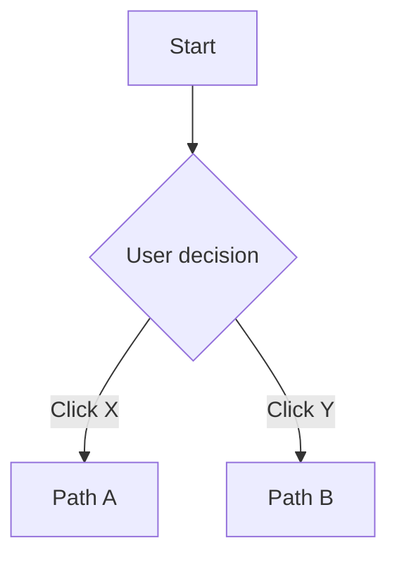

# Muse: A Manifesto for Joyful Creation

## The Joy Has Been Lost from The Creative Process

---

# Pure Markdown + Local MCP Server (?,?,?)

## Summary of Change
Muse is refocusing its knowledge, workflow, and collaboration practices around **pure Markdown files with structured data annotations** stored directly in the repository as the "single source of truth" for living docs, specs, retros, onboarding, design processes, and team knowledge. We're integrating these Markdown files with an MCP (Model Context Protocol) server to connect AI agents, automate workflows, and enable richer, more adaptive collaboration across human and digital teammates.

This upgrade makes our stack more open, portable, and joyful—streamlining both creative work and technical delivery while keeping everything version-controlled alongside our code.

---

## Why Pure Markdown + Repo-Based Docs

- **Living Documentation:** Markdown files support dynamic editing, versioning through Git, and collaborative design—ideal for Muse's principle that "All docs are living."
- **Radical Openness:** Files can be published directly from repo to web, removing internal-external barriers.
- **Version Control Native:** Full Git history, branching, and merge workflows for all documentation.
- **Zero External Dependencies:** No SaaS lock-in, no API rate limits, no external service outages.
- **AI-Friendly:** Structured markdown with frontmatter and annotations is perfect for AI parsing and generation.
- **Developer-First:** Documentation lives where the code lives, ensuring they stay in sync.
- **Cross-Platform Portability:** Markdown works everywhere—editors, GitHub, static site generators, AI tools.

---

## Role of MCP Server

The MCP server acts as a bridge between repository-based Markdown files and diverse AI agents (Claude, Gemini, GPT), automating the flow of information, document generation, knowledge curation, and workflow coordination. MCP:

- Reads and summarizes living docs from the repository
- Proposes process upgrades, onboarding flows, or spec-to-code scaffolding
- Powers bot teammates within the version-controlled knowledge workspace
- Enables cross-platform workflow automation while maintaining Git history
- Maintains context across different AI tools and human workflows
- Automatically updates documentation based on code changes and commit history

---

## Repository Structure for Living Docs

```
/
├── docs/
│   ├── process/
│   │   ├── muse-flow.md
│   │   ├── retrospectives/
│   │   │   ├── 2024-08-sprint-01.md
│   │   │   └── template.md
│   │   └── onboarding/
│   │       ├── developer-setup.md
│   │       └── design-system.md
│   ├── specs/
│   │   ├── features/
│   │   │   ├── user-onboarding.feature
│   │   │   └── payment-flow.feature
│   │   └── technical/
│   │       ├── api-contracts.md
│   │       └── architecture-decisions/
│   │           ├── 001-database-choice.md
│   │           └── template.md
│   ├── design/
│   │   ├── explorations/
│   │   │   ├── mobile-nav-sketches.md
│   │   │   └── user-flow-diagrams.md
│   │   └── system/
│   │       ├── design-tokens.md
│   │       └── component-patterns.md
│   └── knowledge/
│       ├── team-decisions.md
│       ├── stakeholder-communication.md
│       └── project-context.md
├── .muse/
│   ├── config.yaml
│   ├── templates/
│   └── automation/
└── components/
    ├── ui/
    └── features/
```

---

## Structured Data Annotations in Markdown

Using frontmatter and structured sections to make documents AI-parseable and automation-friendly:

### Example: Feature Spec with Annotations


---
type: feature-spec
stage: 2
confidence: high
epic: user-onboarding-epic
assignee: dev-team-alpha
status: ready-for-development
created: 2024-08-23
updated: 2024-08-23
related_files:
  - components/features/SignupForm.tsx
  - docs/design/explorations/onboarding-flow.md
tags: [auth, onboarding, high-priority]
---

# User Registration Flow

## Epic Context
**Epic:** Simplify Mobile Onboarding
Users need to get started quickly without confusion or friction.

## Jobs to be Done
When a new visitor wants to create an account, they want a quick and secure signup process so they can start using the product immediately.

## BDD Specification

```gherkin
Feature: User registration flow

  Scenario: Successful email registration
    Given a visitor is on the homepage
    When they click "Get Started"
    And they fill out the registration form with valid email and password
    Then they should see a welcome screen
    And they should receive a confirmation email
```

## Implementation Notes
- Form validation should happen client-side first
- Password requirements: 8+ chars, 1 uppercase, 1 number
- Email verification required before account activation

## Definition of Done
- [ ] BDD spec passes in Playwright
- [ ] Form handles all error states gracefully
- [ ] Email confirmation system works
- [ ] Mobile responsive design verified
- [ ] Accessibility checked with screen reader

```

### Example: Retrospective with Structured Data

```markdown
---
type: retrospective
date: 2024-08-23
sprint: sprint-12
participants: [alice, bob, charlie, diana]
facilitator: alice
duration: 45min
format: async-prep-sync-discussion
sentiment: positive
---

# Sprint 12 Retrospective

## What Went Well 🟢
- BDD specs caught 3 edge cases before they reached production
- New markdown documentation system reduced context switching
- MCP server automation saved ~4 hours of manual spec writing

## What Could Improve 🟡
- Some feature specs were too high-level and needed refinement during development  
- Need better process for handling design changes mid-development

## Action Items 🔴
- [ ] Create spec refinement checklist for Stage 2 (@bob, due: 2024-08-30)
- [ ] Document design-change workflow in process docs (@diana, due: 2024-09-06)
- [ ] Set up automated spec validation in pre-commit hooks (@charlie, due: 2024-09-15)

## Metrics
- Features delivered: 4
- Spec coverage: 98%
- Bugs found in production: 1 (non-critical)
- Team velocity: 23 points
- Stakeholder satisfaction: 4.2/5

## Process Health
- Time from spec to user feedback: 8 days (target: <10 days) ✅
- BDD spec failure rate: 5% (target: <10%) ✅  
- Component rework vs new development: 15% (target: <20%) ✅
```

---

## Updated Stack Table

| Stack | Examples |
|-------|----------|
| **Tech** | Next.js, Prisma, Postgres, TypeScript, Vercel |
| **Tool** | Git, Markdown, Figma, GitHub Projects, Playwright |
| **Team** | Devs, Designers, PMs, AI agents (Claude, Gemini, Copilot) |
| **Workflow** | Async rituals, release cadence, QA protocols |
| **Knowledge** | Markdown docs in `/docs`, code repo, version-controlled guides |
| **Integration** | MCP server, GitHub Actions, automated doc generation |
| **Governance & Ops** | Git permissions, branch protection, automated workflows |
| **Culture** | Muse principles, communication norms, documentation-first |

---

## MCP Server Integration with Repository

### Automated Documentation Workflows

The MCP server monitors the repository and provides intelligent assistance:

**Document Management:**
- **Auto-linking:** Detects relationships between specs, ADRs, and code files
- **Freshness Monitoring:** Flags docs that may be outdated based on related code changes
- **Template Enforcement:** Ensures new documents follow established patterns
- **Cross-Reference Validation:** Verifies links between documents remain valid

**AI-Powered Assistance:**
- **Spec Generation:** Creates BDD specs from design explorations and user stories
- **ADR Drafting:** Proposes architectural decision records based on code changes
- **Retrospective Insights:** Analyzes patterns across retrospective data
- **Knowledge Extraction:** Surfaces insights from commit history and documentation

**Workflow Automation:**
- **PR Documentation:** Automatically updates related docs when code changes
- **Spec Validation:** Checks that new features have corresponding BDD specs
- **Status Updates:** Maintains project status based on file changes and Git activity
- **Notification Intelligence:** Smart alerts when documentation needs attention

### Example MCP Configuration

```yaml
# .muse/config.yaml
mcp_server:
  document_roots:
    - "docs/"
    - "components/"
  
  auto_linking:
    enabled: true
    patterns:
      - "*.feature -> components/**/*.tsx"
      - "docs/design/explorations/*.md -> docs/specs/features/*.feature"
      - "docs/architecture-decisions/*.md -> src/**/*"
  
  ai_assistants:
    spec_writer:
      model: "claude-sonnet-4"
      context_files: ["docs/process/muse-flow.md"]
      templates: [".muse/templates/bdd-spec.md"]
    
    adr_assistant:
      model: "gpt-4"
      watch_paths: ["src/", "components/"]
      template: ".muse/templates/adr.md"

  workflows:
    - name: "spec-validation"
      trigger: "pr_open"
      action: "check_feature_spec_exists"
    
    - name: "doc-freshness"
      trigger: "weekly"
      action: "flag_stale_documentation"
```

---

## Documentation-First Development

### Living Specs Drive Everything

Instead of documentation being an afterthought, it becomes the primary interface:

**Spec-to-Code Flow:**
1. Design exploration captured in markdown with Mermaid diagrams
2. BDD feature specs written with structured annotations
3. MCP server generates component scaffolding from specs
4. Development happens with continuous spec validation
5. Documentation updates automatically based on code changes

**Version Control Integration:**
- All documentation changes go through PR review
- Git blame shows who made decisions and when
- Branch-based documentation for feature development
- Automatic linking between commits and related documentation

**AI-Augmented Writing:**
- MCP server suggests improvements to specs based on code patterns
- Auto-generation of boilerplate documentation from templates
- Intelligent cross-referencing between related documents
- Pattern recognition from successful previous specs

---

## Next Steps

1. **Migrate existing documentation to repository structure**
2. **Set up MCP server with repository integration**
3. **Create documentation templates and automation workflows**
4. **Establish Git-based review processes for documentation**
5. **Train team on markdown-first, version-controlled documentation practices**
6. **Build automated linking between code changes and documentation updates**

---

**Muse 2.0 sets the standard for creative, transparent, adaptive teamwork—powered by pure Markdown, orchestrated by MCP, version-controlled by Git, and amplified by every contributor.**

---

## 🌿 "Muse Flow (music)" – Strategic Planning to Working Code

      Living Docs ↔ Working Code
            ↑    ❤️‍🔥    ↓
    Lo‑Fi Design ↔ Real Development

### Process Overview

Muse flows through strategic planning followed by five **iterative stages**. **Strategic Planning** establishes the foundation, while **Design and Development operate in parallel** during the creative flow, with each stage continuously informing the others. All documentation lives in the repository and evolves with the code.

### Strategic Planning
| Phase | Stage | Name | Purpose |
|-------|-------|------|---------|
| **Strategic** | -1 | Epic Definition & JTBD Context | Define business objectives and user jobs-to-be-done at the initiative level. |
| **Prep** | 0 | Repository Setup & Data Discovery | Establish git-based documentation workflows and investigate real data conditions. |

### Creative Flow
| Phase | Stage | Name | Purpose |
|-------|-------|------|---------|
| **Design ↔ Develop** | 1 | Ideation & Lo-Fi Exploration | Rapid, low-cost idea exploration documented in markdown with diagrams. |
| | 2 | Self-Validating Specifications | BDD feature specs with structured annotations that define user journeys and auto-generate test scaffolding. |
| | 3 | Direct Development with Real Data | Build components in-context with real data and edge cases from day one. |
| **Launch & Learn** | 4 | Release Cadence | Lightweight, continuous flow of deployment and prioritization. |
| | 5 | Monitoring, Observability & Impact | Data-driven feedback loop to validate feature success and improve future iterations. |

Each stage is iterative — teams are encouraged to revisit, refine, and loop back as new insights emerge. All decisions and learnings are captured in version-controlled markdown files.

---

## 🧠 Key Philosophy Shifts

- **Human-Centered Design First:** Start with full user journeys, not isolated tasks.
- **Physics of Flow:** Work flows "just in time" with no handoff friction.
- **Context-Native Components:** Built directly in their live data environments.
- **Evolutionary BDD:** Self-validating specs that evolve with usage patterns.
- **Real Data Over Mock Data:** Edge cases are discovered during development.
- **Dual Track Async Design/Dev:** Design informs dev at natural points—not forced checkpoints.
- **Process-as-a-Product:** The methodology itself is subject to feedback and evolution.
- **Documentation-as-Code:** All process docs, specs, and knowledge live in version control.
- **AI-Aided Design Sprints:** Compressed into hours not weeks, aided by human-curated AI.
- **Minimal Viable Documentation:** Document where it provides the most value, keep it in Git.
- **User-Controlled UI:** Respect system preferences (e.g., dark mode, prefers) and avoid anti-features like theme toggles.
- **Async-Meeting Culture:** Replace time-wasting meetings with purposeful, async communication and focused collaboration.
- **Lean Operations, Rich Creation:** We aggressively favor free-tier and open-source tools. Money should be spent on what directly creates user value, not on operational overhead. This keeps the team lean, agile, and focused on the joy of building, not on burn rates.

---

## 🗣️ Stakeholder Rhythm (Async-Meeting Culture)

### Unified Leadership, Natural Flow

Muse operates on a **hybrid approach** between visionary leadership and tactical execution:

- **Yearly Vision:** Higher-level management provides annual direction and documents strategic goals in `/docs/strategy/`
- **Evolutionary Execution:** Teams adapt and refine implementation based on real-world feedback, documented in version control
- **Management by Exception:** C-level involvement only when direction needs clarification or major obstacles arise

### Communication Cadence

**Daily: Async Standups**
- Written updates via GitHub Discussions or markdown files in `/docs/standups/`
- Automated prompts for missing updates via GitHub Actions
- No synchronous meetings required
- Focus on progress, blockers, and next steps
- AI bot assists with note-taking and ticket creation

**Weekly: Encouragement & Alignment**
- 30-minute team check-in focused on morale and high-level direction
- Notes captured in `/docs/team-syncs/`
- Not a status meeting—more like "how are we feeling about this work?"
- Rotate leadership to prevent meeting fatigue

**Bi-weekly: Stakeholder Previews**
- Share Vercel preview links with light commentary in `/docs/stakeholder-updates/`
- Stakeholders provide feedback asynchronously via GitHub issues or discussions
- Focus on "is this the right direction?" rather than pixel-perfect feedback

**Monthly: Strategic Alignment**
- Leadership reviews overall direction and priorities
- Adjust course based on Stage 5 monitoring data captured in `/docs/metrics/`
- Plan resource allocation and team needs
- All decisions documented in `/docs/decisions/`

### Blocker Resolution Protocol

- **Real-time via Chat:** Blockers are resolved immediately between the blocked person and the blocker
- **AI Assistant:** MCP server monitors conversations and suggests creating issues or documenting decisions
- **No Meeting Required:** Most blockers can be resolved through quick chat or screen share
- **Decision Documentation:** Important resolutions captured in `/docs/decisions/` automatically

---

## 🕰️ The Sustainable Work Rhythm Stimulates Play

### The 4.5-Day Week Structure

**Week A (Full Week):**
- Monday: 9 hours 
- Tuesday: 9 hours 
- Wednesday: 9 hours 
- Thursday: 9 hours 
- Friday: 9 hours 

**Week B (Long Weekend):**
- Monday: 9 hours 
- Tuesday: 9 hours 
- Wednesday: 9 hours 
- Thursday: 9 hours 
- Friday: OFF

**Total:** 40.5 hours per week average across the year (50 work weeks)

### Suggested Day divisions
Museicians should start a 6 am but late sleepers can opt for 10 am but some benefits will be lost.
The workday is divided into 3 3 hour chunks with the first 6 hours as the ‘cone of silence’ slack is muted for zero interruptions.
The last 3 hour chunk is slack open for quick colaborations and jokes.
The 3 hours after the work day is done is still open for Slack communications but the messagee is not obligated to answer.
The only exception to the cone of silence is blocked work in todays que.


### Benefits

- **3-day weekends every other week** for creative rest and personal time
- **Predictable rhythm** that teams can plan around
- **Focused work blocks** that reduce context switching
- **Built-in rest** that research shows is essential for creative work

---

## 🤖 AI Communication Assistant & MCP Integration

### Repository-Powered AI Workflows

An AI ecosystem powered by MCP (Model Context Protocol) connects repository markdown files with multiple AI agents, providing intelligent assistance across the entire development lifecycle:

**MCP Server Capabilities:**
- **Living Document Management:** AI agents read, summarize, and propose updates to markdown documentation in the repository
- **Cross-Platform Context:** Maintains awareness of GitHub issues, code changes, and documentation simultaneously  
- **Workflow Automation:** Automatically creates issues, updates documentation, and generates structured notes
- **Knowledge Curation:** Suggests connections between related docs, identifies outdated information, and maintains cross-references

**Proactive AI Suggestions:**
- "Should I create a feature spec for that user story in `/docs/specs/features/`?"
- "This technical discussion relates to the onboarding spec—want me to link it?"
- "I noticed this decision might warrant an ADR in `/docs/architecture-decisions/`"
- "Based on recent retrospectives, should we adjust our process documentation?"

**Automatic Documentation:**
- Summarizes ad-hoc technical discussions from chat
- Extracts action items and updates relevant markdown files
- Links conversations to GitHub issues and feature specs
- Generates retrospective insights from commit history and team communication

**Context-Aware Intelligence:**
- Understands current project goals from roadmap docs in `/docs/strategy/`
- Recognizes when conversations should be captured in documentation
- Suggests moving detailed discussions to appropriate markdown files
- Proposes connections between similar patterns across projects

### Implementation Approach

- **Start Simple:** Basic file system monitoring with MCP server for document management
- **Evolve Gradually:** Add more sophisticated AI agents and workflow automation over time
- **Privacy First:** Team controls what information AI agents can access and modify
- **Human Oversight:** All AI suggestions require human approval before making changes
- **Git-Based:** All changes go through normal Git workflow with proper commit messages

---

## 📊 Living Retrospectives & Process Evolution

### Git-Powered Continuous Improvement

Retrospectives and process improvements are embedded in the version-controlled documentation system, making insights actionable and preventing the loss of institutional knowledge:

**Retrospective Documentation:**
- Each retrospective captured as markdown file in `/docs/retrospectives/` with structured frontmatter
- AI agents analyze patterns across retrospectives to suggest process improvements
- Action items automatically linked to relevant process documentation
- Historical trends visible through Git history and automated reporting

**Process Documentation Evolution:**
- All methodology docs live in `/docs/process/` and evolve based on retrospective insights
- Version history maintained automatically through Git
- AI suggests updates to process docs based on team feedback patterns
- Changes visible to entire team with PR review workflow

**Knowledge Retention:**
- Team decisions captured in `/docs/decisions/` with full context
- Onboarding materials in `/docs/onboarding/` automatically updated based on new team member feedback
- Process antipatterns documented alongside successful patterns
- Full-text search across all team knowledge through repository search

**Automated Insights:**
- MCP server analyzes retrospective data across multiple files to identify recurring themes
- Suggests connections between process issues and team outcomes
- Proposes experiments for process improvements in structured format
- Tracks the success of implemented changes through documentation analysis

---

## 🏗️ Technical Debt Management Strategy

### Future-Friendly Architecture

Rather than fighting technical debt, Muse embraces technological evolution:

**Lightweight but Powerful:**
- Choose libraries with excellent documentation and strong communities
- Prioritize simplicity over premature optimization
- Focus on standards-based solutions that age well

**AI-Assisted Migration:**
- Document architectural decisions in `/docs/architecture-decisions/` to support future AI-powered refactoring
- Maintain clear component boundaries for easier replacement
- Use TypeScript and structured schemas to support automated code generation

**Incremental Replacement:**
- New features use current best practices
- Legacy code is migrated opportunistically when touched
- Avoid big-bang rewrites in favor of gradual modernization

### Specification Evolution Framework

**Spec Confidence Levels:**

| Confidence Level | Description | Testing Strategy |
|------------------|-------------|------------------|
| **High Confidence** | Well-understood patterns with clear user research backing | Comprehensive test coverage required |
| **Medium Confidence** | Reasonable assumptions based on similar features | Standard test coverage |
| **Low Confidence** | Experimental features requiring heavy monitoring and iteration | Lightweight test coverage initially |

**Evolution Triggers:**
- Stage 5 monitoring reveals different usage patterns than expected
- Real user feedback contradicts original assumptions
- Technical constraints emerge during development

---

## Extension: Epic-Level Context & JTBD Simplicity

### Epic-Level Flow

- **Explicit Epic Context:**  
  Every major initiative starts with a brief, plain-English "Epic" document in `/docs/epics/` detailing what, why, and for whom.

- **Traceability:**  
  Downstream specs, designs, and code always reference the originating Epic through structured annotations to maintain business alignment and clarity.

### JTBD Usage – Kept Simple

- **Limit JTBD to Story Level:**  
  For simplicity and maximum clarity, JTBD is applied **only at the story/feature/spec level**—not at the epic or roadmap scale.  
  _This keeps strategic planning clean and saves executive time._

- **Features and Specs:**  
  Each story, user journey, or BDD spec clarifies the specific job-to-be-done for the user, fighting unnecessary abstraction.

- **Executives and Roadmaps:**  
  Epics and high-level planning rely on plain language, business value, and measurable outcomes—leaving JTBD for targeted features where detail matters most.

### Example Structure

```markdown
---
type: epic
status: active
owner: product-team
created: 2024-08-23
---

# Epic: Simplify Mobile Onboarding

## Context
Users are dropping off during the onboarding process at a rate of 45%, particularly on mobile devices.

## Narrative
Streamline the mobile onboarding experience to reduce friction and increase user activation rates.

## Success Criteria
- Reduce mobile onboarding drop-off to <25%
- Increase mobile user activation by 30%
- Maintain security and compliance requirements

## Related Files
- [Mobile Onboarding Feature Spec](../specs/features/mobile-onboarding.feature)
- [Design Exploration](../design/explorations/mobile-onboarding.md)
```

---

## 🌱 STRATEGIC PLANNING PHASE

### Stage -1: Epic Definition & JTBD Context

Define high-level business objectives and user jobs-to-be-done at the initiative level. This stage establishes the strategic context that guides all downstream work, documented in `/docs/epics/`.

**Epic Definition:**
- Brief, plain-English description of what, why, and for whom
- Clear business value and success criteria
- Scope boundaries and constraints
- Timeline and resource considerations

**JTBD Context:**
- Limited to story/feature/spec level for clarity
- Avoids over-abstraction at epic/roadmap scale
- Maintains business alignment without excessive process

**Traceability:**
- All downstream specs, designs, and code reference originating Epic through frontmatter
- Clear path from strategic intent to tactical execution
- Regular validation that work serves intended purpose

#### ✅ "Done" Definition for Epics

An Epic is considered ready when:
- Business value and user outcome are clearly defined in `/docs/epics/epic-name.md`
- Success metrics are established
- Scope and constraints are documented
- Stakeholder alignment is confirmed through PR review
- Ready to move to Stage 0 setup

### Stage 0: Repository Setup & Data Discovery

Establish a unified system of record for ideas, specs, code, and decisions using **repository-based markdown files as the central hub**, integrated with development workflow through Git. This creates full traceability from ideation to release and supports asynchronous, remote-first collaboration with AI-augmented workflows.

**Repository Documentation Structure:**
- **Living Documentation Hub:** All process docs, specs, retrospectives, and onboarding materials in structured `/docs/` directory
- **Public Documentation:** Key documentation automatically published from repository
- **Structured Data:** Project tracking, team knowledge, and decision logs in markdown with frontmatter
- **AI Agent Integration:** MCP server enables AI assistants to read, analyze, and propose updates to markdown files
- **Git-Based Workflow:** All documentation changes go through standard PR review process

In parallel, conduct a **pre-development data audit** documented in `/docs/technical/data-reality.md` to ensure the system starts with a shared understanding of current data reality:

- **Data Inventory & Profiling:** Use tools like `prisma db pull`, AI-assisted schema generators, or exploratory queries to profile existing structures.
- **Quality Baseline:** Define what "clean enough" looks like per key user journeys.
- **Reality Contracts:** Treat the current database schema as a living contract. Evolve it over time rather than attempting perfection upfront.
- **Git-Based ADRs:** Architectural decisions are captured in `/docs/architecture-decisions/` when they happen, using AI to assist with formatting and clarity.

#### Data Reality Check Template

```markdown
---
type: technical-assessment
component: database
status: baseline
created: 2024-08-23
---

# Data Reality Assessment

## Current State
- [ ] Schema documentation exists and is current
- [ ] Edge cases identified (nulls, empty arrays, malformed data)
- [ ] Performance baselines established
- [ ] Data privacy/security constraints documented
- [ ] Migration path planned for schema evolution
- [ ] Real user data patterns analyzed
- [ ] API contracts defined and versioned

## Schema Example

```prisma
model User {
  id    String @id @default(cuid())
  email String @unique
  name  String?
  posts Post[]
}

model Post {
  id       String @id @default(cuid())
  title    String
  content  String?
  authorId String
  author   User   @relation(fields: [authorId], references: [id])
}
```

## Quality Contracts
- Email field: Must be valid format, unique constraint enforced
- User names: Optional, handle graceful degradation in UI
- Posts: Content can be null for draft state
```

*NOTE: These processes will be markdown-based with structured frontmatter, with the goal of increasing automation over time as patterns solidify.*

---

## 🎨 DESIGN ↔ 🔧 DEVELOP PHASE (PARALLEL)

### Stage 1: Ideation & Lo-Fi Exploration

Artifacts at this stage are intentionally low-fidelity and disposable to avoid locking into the wrong design. All explorations are captured in `/docs/design/explorations/` with markdown and Mermaid diagrams.

Includes sketches, whiteboards, or markdown-based wireframes with embedded diagrams. The goal is to find the right problem and approach before committing to code. All explorations are version-controlled and linked to GitHub Discussions for visibility.

- **Design Status Tags:** Use frontmatter status fields (`exploring`, `validating`, `ready`) to manage design iteration.
- **Design Definition of Done:** A sketch or flow is considered "done" when:
  - It solves a validated user problem
  - It aligns with known constraints (data, tech, UX)
  - It is peer-reviewed through PR process
  - It is clearly documented in markdown with embedded diagrams
  - It's ready to promote to spec (Stage 2)

- **Markdown-Powered Sketching:** Use [Mermaid](https://mermaid-js.github.io/) to create diagrams directly in markdown files:



- **Cross-Stage Visibility:** When validated, sketches are preserved in `/docs/design/explorations/` with links to resulting specs.
- **AI-Aided Variation:** Prompt AI through MCP server to generate alternative flows for comparison.
- **Iterative by Design:** Expect to return to this stage as specs or components raise new insights, tracked through Git history.

### Stage 2: Self-Validating Specifications

*Bridge between design and development, where user intent becomes executable truth.*

Stage 2 formalizes validated design ideas into executable, living specifications stored in `/docs/specs/features/`. These take the form of human-readable `.feature` files using **Behavior-Driven Development (BDD)**, which define complete user journeys in plain language. These specs double as documentation and automated tests, ensuring every feature delivers clear value and is always tested against real expectations.

#### 📄 The Spec Format

Specs are written in [Gherkin](https://cucumber.io/docs/gherkin/) syntax with structured frontmatter:

```gherkin
---
type: feature-spec
stage: 2
confidence: high
epic: user-onboarding-epic
assignee: dev-team-alpha
status: ready-for-development
created: 2024-08-23
updated: 2024-08-23
related_files:
  - components/features/SignupForm.tsx
  - docs/design/explorations/onboarding-flow.md
tags: [auth, onboarding, high-priority]
---

Feature: User onboarding flow

Background:
  This feature addresses the job of helping new users get started quickly without confusion.
  
Scenario: New user completes signup
  Given a visitor is on the homepage
  When they click "Get Started"
  And they fill out the registration form
  Then they should see a welcome screen
```

- **Feature:** The high-level user value
- **Scenario:** A single outcome or journey path
- **Given/When/Then:** The sequence of user behavior and expected results
- **Frontmatter:** Structured metadata for AI parsing and workflow automation

#### ✅ What Makes a Spec "Done"?

A self-validating spec is considered ready when:

- The problem is validated via Design (Stage 1) with linked exploration docs
- The journey is expressed in plain language and testable steps
- It includes real-world edge cases (e.g. bad input, missing data)
- It includes confidence level assessment (High/Medium/Low) in frontmatter
- It is peer-reviewed through PR process with proper Git workflow
- It runs as a Playwright or Cucumber test
- It passes with current data or raises intentional failures for edge cases

#### 🎯 Spec Confidence Levels

| Confidence Level | Characteristics | Testing Strategy |
|------------------|-----------------|------------------|
| **High Confidence** | Based on validated user research or established patterns | BDD + visual smoke test |
| **Medium Confidence** | Reasonable assumptions based on similar features | BDD + device matrix + a11y checks |
| **Low Confidence** | Experimental features or new problem domains | BDD + session replay + user testing + analytics tracking |

#### 🧐 UX-Risk-Based Testing Strategy

Not all features need the same rigor. Testing intensity scales with the user experience impact and novelty:

| UX Risk | Example Features | Testing Strategy |
|---------|------------------|------------------|
| **Low** | Standard login, pagination | BDD + visual smoke test |
| **Medium** | Onboarding wizard, payment flow | BDD + device matrix + a11y checks |
| **High** | Complex dashboards, dynamic UIs | BDD + session replay + user testing + analytics tracking |

This approach saves effort on boilerplate while focusing deeply on what's risky or novel.

#### 🛠️ Tools & Integration

- **Playwright + Cucumber:** Automates `.feature` specs as browser-based end-to-end tests
- **Test Runs in CI:** Every commit runs all passing `.feature` files using real or seeded data
- **PR Hooks:** Specs required for any new feature before merge
- **Documentation Integration:** Specs automatically linked to related markdown docs through frontmatter

#### ♻️ Evolutionary Feedback Loop

- Failed tests signal **spec drift**—revisit design or refine the expectation
- Usage analytics (Stage 5) inform spec updates, tracked in Git history
- AI can suggest edits or identify untested paths through MCP server analysis

Example AI prompt:
> "Analyze the user onboarding spec against recent session data and suggest missing scenarios."

*NOTE: These specs and tests are not static. They evolve over time through Git workflow as user data and real usage provide new insight.*

---

### Stage 3: Direct Development with Real Data

Stage 3 is where code meets reality. Instead of developing components in isolation with mock data, we build them **directly in the Next.js application context**, using real schemas and live or seeded data. This ensures every feature is grounded in truth, resilient to edge cases, and continuously informed by how users actually interact. All component documentation lives alongside the code with markdown files.

#### 🧬 Context-Native Development

- Components are built **inside their intended context**, not abstracted sandboxes.
- Instead of "design to dev handoff," the developer works from the spec and real user data simultaneously.
- Edge cases are surfaced automatically, not weeks later during QA.
- Flow between spec (Stage 2) → component → feedback (Stage 4) is seamless.
- Component documentation in `/docs/components/` stays in sync with implementation.

#### 📚 Design System in Code

Instead of a separate design token file or external design library, the system evolves in the codebase with documentation in markdown:

- **Design Tokens via Tailwind**: Define consistent colors, spacing, etc.
- **Component Documentation**: Each component documented in `/docs/components/` with usage examples
- **Automated Linking**: MCP server maintains links between component docs and implementation files

```css
// globals.css
@theme {
  --font-display: "Satoshi", "sans-serif";
  --breakpoint-3xl: 120rem;
  --color-avocado-100: oklch(0.99 0 0);
  --color-avocado-200: oklch(0.98 0.04 113.22);
  --color-avocado-300: oklch(0.94 0.11 115.03);
  --ease-fluid: cubic-bezier(0.3, 0, 0, 1);
  --ease-snappy: cubic-bezier(0.2, 0, 0, 1);
  /* ... */
}
```

##### Component Architecture

**🔹 1. Components → /components/ui**

💡 **Purpose:** Reusable building blocks. Pure presentation.
📦 **Contents:** Buttons, Inputs, Icons, Avatars, etc.
📄 **Documentation:** `/docs/components/ui/`

- No business/domain knowledge
- No layout assumptions
- Just props in → UI out
- Fully covered by the design system
- Each component has corresponding markdown documentation

```typescript
// Button.tsx
import * as Headless from '@headlessui/react'
import clsx from 'clsx'
import React, { forwardRef } from 'react'
import { Link } from './link'

const styles = {
  base: [
    'relative isolate inline-flex items-baseline justify-center gap-x-2 rounded-lg border text-base/6 font-semibold',
    'px-[calc(--spacing(3.5)-1px)] py-[calc(--spacing(2.5)-1px)] sm:px-[calc(--spacing(3)-1px)] sm:py-[calc(--spacing(1.5)-1px)] sm:text-sm/6',
    'focus:not-data-focus:outline-hidden data-focus:outline-2 data-focus:outline-offset-2 data-focus:outline-blue-500',
    'data-disabled:opacity-50',
    '*:data-[slot=icon]:-mx-0.5 *:data-[slot=icon]:my-0.5 *:data-[slot=icon]:size-5 *:data-[slot=icon]:shrink-0',
  ],
  solid: [
    'border-transparent bg-(--btn-border)',
    'dark:bg-(--btn-bg)',
    'before:absolute before:inset-0 before:-z-10 before:rounded-[calc(var(--radius-lg)-1px)] before:bg-(--btn-bg)',
    'before:shadow-sm',
  ],
  red: [
    'text-white [--btn-hover-overlay:var(--color-white)]/10 [--btn-bg:var(--color-red-600)] [--btn-border:var(--color-red-700)]/90',
    '[--btn-icon:var(--color-red-300)] data-active:[--btn-icon:var(--color-red-200)] data-hover:[--btn-icon:var(--color-red-200)]',
  ],
}

export const Button = forwardRef(function Button({ color, outline, plain, className, children, ...props }, ref) {
  let classes = clsx(
    className,
    styles.base,
    outline ? styles.outline : plain ? styles.plain : clsx(styles.solid, styles.colors[color ?? 'dark/zinc'])
  )

  return 'href' in props ? (
    <Link {...props} className={classes} ref={ref}>
      <TouchTarget>{children}</TouchTarget>
    </Link>
  ) : (
    <Headless.Button {...props} className={clsx(classes, 'cursor-default')} ref={ref}>
      <TouchTarget>{children}</TouchTarget>
    </Headless.Button>
  )
})

export function TouchTarget({ children }) {
  return (
    <>
      <span className="absolute top-1/2 left-1/2 size-[max(100%,2.75rem)] -translate-x-1/2 -translate-y-1/2 pointer-fine:hidden" aria-hidden="true" />
      {children}
    </>
  )
}
```

**Component Documentation Example:**

```markdown
---
type: component-docs
component: Button
category: ui
status: stable
last_updated: 2024-08-23
related_files:
  - components/ui/Button.tsx
  - docs/design/system/buttons.md
---

# Button Component

## Purpose
Reusable button component with consistent styling and behavior across the application.

## Usage

```tsx
import { Button } from '@/components/ui'

// Basic usage
<Button>Click me</Button>

// With color
<Button color="red">Delete</Button>

// As link
<Button href="/signup">Sign up</Button>
```

## Props
- `color`: 'red' | 'blue' | 'green' | etc.
- `outline`: boolean - Use outline style
- `plain`: boolean - Use minimal style
- `href`: string - Render as Link component

## Design Tokens
Uses the following design tokens:
- `--btn-bg`: Button background color
- `--btn-border`: Button border color
- `--btn-hover-overlay`: Hover state overlay

## Accessibility
- Focus management with `data-focus` attributes
- Touch targets meet minimum size requirements
- Semantic button vs link rendering based on props
```

**🔸 2. Features → /components/features**

💡 **Purpose:** Domain-aware components that implement flows or page-specific functionality
📦 **Contents:** SignupForm, ProductList, UserProfileCard, CommentThread
📄 **Documentation:** `/docs/components/features/`

- Composes multiple atoms
- Can contain logic (e.g., fetch, validation)
- Bound to business domain or app feature
- Mapped directly to .feature files

```typescript
// SignupForm.tsx
import { Input, Button } from "@/components/ui";

export function SignupForm() {
  const { register, handleSubmit } = useForm();
  return (
    <form onSubmit={handleSubmit(...)} className="space-y-4">
      <Input {...register("email")} />
      <Input {...register("password")} type="password" />
      <Button type="submit">Sign Up</Button>
    </form>
  );
}
```

**🟦 3. Layouts → /app/layout.tsx (or /layouts)**

💡 **Purpose:** Structural container for pages
📦 **Contents:** Header, Footer, Sidebar, Page shell using CSS Grid
📄 **Documentation:** `/docs/components/layouts/`

- Defines grid-template-areas and placement
- Rarely needs logic (though can conditionally show/hide sections)
- Controls flow/responsiveness — e.g. how aside, main, footer shift on small screens

#### Tech Stack & Feedback Integration

The foundational technology and feedback mechanisms that power fast, reliable development are documented in `/docs/technical/stack.md`:

**Tech Stack Highlights:**
- **Monorepo with Turborepo:** Enables sharing components, BDD specs, utilities, and data contracts between clean and legacy projects.
- **Data Layer - Prisma + TanStack Query:** Type-safe ORM documented in `/docs/technical/database.md`
- **Database - Vercel Postgres:** Configuration and schema docs in `/docs/technical/`
- **Framework - Next.js (App Router):** Architecture decisions in `/docs/architecture-decisions/`
- **Language - TypeScript:** Coding standards in `/docs/technical/typescript-guide.md`
- **Styling - Tailwind CSS:** Design system docs in `/docs/design/system/`

**Feedback & Workflow Integration:**
- **Vercel Preview Deployments:** Every branch gets an instant, shareable preview environment
- **Pull Request Integration:** Component docs updated automatically with code changes
- **Automated CI Tests:** Playwright & Cucumber specs run on every push
- **Documentation Sync:** MCP server maintains links between code and documentation

#### Process Health Monitoring

**Retrospective Triggers (tracked in `/docs/metrics/`):**
- When features take >2 weeks to get user feedback
- When >30% of BDD specs fail in production
- When component rework exceeds new development time
- When stakeholder feedback conflicts with established specs

**Quality Gates:**
- All new features must have corresponding BDD specs
- All components must have documentation in `/docs/components/`
- All API changes must be documented in `/docs/technical/api/`
- All PRs must include updated documentation links

#### ✅ "Done" Definition for Components

A component is considered complete when:

- It fulfills a corresponding `.feature` scenario
- It handles both typical and messy real-world data
- It uses tokens, styles, and patterns from the shared system
- It has documentation in `/docs/components/` that's up to date
- It's covered by an automated test or manual test case
- It's reviewed in a PR with proper documentation updates
- It gracefully degrades if data is missing or invalid

#### 🔁 Bidirectional Flow

- **Upstream to Design:** Building reveals missing states or complexity → Design docs updated in `/docs/design/explorations/`
- **Downstream to Feedback:** Working code is immediately deployed for review in Stage 4
- **Documentation Flow:** Changes trigger documentation updates through MCP server

---

## 🚀 LAUNCH & LEARN PHASE

### Stage 4: Release Cadence

The Release Cadence stage operationalizes delivery with all decisions and processes documented in `/docs/releases/`. Instead of heavyweight release trains, Muse emphasizes small, safe, and frequent releases driven by feature readiness—not calendar dates. This enables faster feedback, reduces risk, and allows teams to stay focused on user value.

#### 🚀 Continuous Delivery, Not Continuous Chaos

- **CI/CD Pipelines:** Every merge deploys to staging; production behind feature flags
- **Release by Feature, Not Sprint:** A feature is released when it's validated—not when the calendar says so
- **Feature Toggles:** Configuration documented in `/docs/technical/feature-flags.md`
- **Progressive Rollouts:** Rollout plans documented in `/docs/releases/rollout-plans/`

#### 🛎 Prioritization Flow

- **Triage Board:** GitHub Projects with automation based on markdown frontmatter
- **Decision-Making Criteria:** Documented in `/docs/process/prioritization.md`
- **Release Planning:** Each release documented in `/docs/releases/YYYY-MM-DD-release-notes.md`
- **Stakeholder Communication:** Release notes automatically generated from feature specs and PR descriptions

#### Risk Management During Releases

- **Rollback Strategy:** Every release includes automated rollback triggers documented in `/docs/technical/deployment.md`
- **Canary Deployments:** High-risk features get gradual exposure with monitoring plans
- **Real-User Monitoring:** Stage 5 metrics inform immediate post-release decisions
- **Communication Plan:** Escalation procedures in `/docs/process/incident-response.md`

#### 🧰 Tools

- **Vercel / Netlify / Railway:** Instant deploy previews and simple rollback
- **Feature Flags:** Configuration managed in code with documentation
- **GitHub Projects:** Automation based on markdown frontmatter and PR labels

#### 🔁 Feedback to Prior Stages

- Real feedback from feature use helps improve specs in `/docs/specs/features/` through Git workflow
- Rollout metrics inform future architecture and observability needs
- UX issues surfaced here are triaged back into design explorations
- All learnings captured in `/docs/retrospectives/`

#### ✅ "Done" Means Shipped & Documented

A feature is considered complete at this stage when:

- It's deployed to production with appropriate flags or rollouts
- It's observed in the wild via metrics documented in `/docs/metrics/`
- Release notes are generated and published
- Monitoring and alerting are in place
- It's safe to move on without technical debt

---

### Stage 5: Monitoring, Observability & Impact

This final stage ensures that deployed features deliver the intended value and feed actionable insights back into the cycle. All monitoring data and insights are captured in `/docs/metrics/` and `/docs/insights/`. By monitoring real-world usage and surfacing impact metrics, teams can validate assumptions, detect regressions, and refine priorities.

#### 📊 Feature Impact Monitoring

- **Core Metric Tracking:** Each feature tied to measurable outcomes documented in `/docs/metrics/feature-metrics.md`
- **Spec Confidence Validation:** Track how High/Medium/Low confidence specs perform in reality
- **Observability Documentation:** Monitoring setup documented in `/docs/technical/observability.md`
- **Session Analysis:** Insights captured in `/docs/insights/user-behavior/`

#### 🧪 Outcome Validation

- **Performance Analysis:** Each feature's success measured against BDD spec intent
- **Confidence Validation:** Document whether confidence assignments were accurate
- **Trend Analysis:** Historical data in `/docs/metrics/trends/`
- **Experimentation Results:** A/B test results in `/docs/experiments/`

#### Learning Integration

- **Spec Evolution:** Usage patterns inform updates to `.feature` files through Git workflow
- **Pattern Documentation:** Successful patterns documented in `/docs/patterns/`
- **Anti-Pattern Library:** Failed approaches recorded in `/docs/patterns/antipatterns.md`
- **Process Refinement:** Methodology updates based on real-world results

#### 📈 Tools

- **PostHog / Plausible / Amplitude:** Event-based user behavior analytics
- **Highlight / Sentry / LogRocket:** Frontend session recording and error tracking
- **Grafana / Prometheus:** System-level performance monitoring
- **Custom Dashboards:** Built with data from `/docs/metrics/` files

#### 🔁 Feedback to All Stages

Insights flow backward through documented processes:

- **To Design**: Real user behavior reveals missed assumptions, documented in `/docs/insights/design-learnings.md`
- **To Specs**: Behavior patterns suggest updates to `.feature` files
- **To Tech Stack**: Performance issues inform architecture decisions in `/docs/architecture-decisions/`
- **To Process**: Methodology improvements documented in `/docs/process/evolution.md`

#### ✅ "Done" Means Verified & Documented

A feature's lifecycle completes when:

- It has demonstrable impact documented in `/docs/metrics/`
- Metrics align with original goals from Epic and specs
- Learnings are captured in `/docs/insights/` for future reference
- Patterns are documented for reuse
- Team has confidence in similar future features

---

## The Muse Cycle: Fast, Lean, Fun 🔄

1.  **AI generates specs from context:**  🤖 AI digests user needs, context, and visuals (including markdown diagrams), outputting _precise_ BDD feature files on a Jobs-to-be-Done basis—each paired with well-documented markdown context in `/docs/specs/`.
    
2.  **AI writes the first 80% of your code:**  ✍️ Those specs and docs drive generation of initial Next.js components, Server Actions, API routes, and Tailwind UIs—structured, maintainable, and documented alongside implementation.
    
3.  **Human review and refinement:**  🧑‍💻🤝 Developers bring the final 20%: expert review, complex business logic, security, optimization—and the creative spark that only people provide. All changes tracked in Git with proper documentation updates.
    
4.  **Automated, spec-driven QA:**  ✅ Playwright takes those BDD specs and rigorously tests the real app. Documentation automatically links test results to specs and components.
    
5.  **Repeat—or advance:**  🔁 Learn from test outcomes and real user data captured in `/docs/metrics/`. Refinements cycle back through Git workflow. Completed features documented for future reference.

## This is the joy of Muse 😃

_Bring the energy, focus, and freedom of great tools back to your team. Build with Muse—the ecosystem that puts humans (and joy) back at the center of software development._